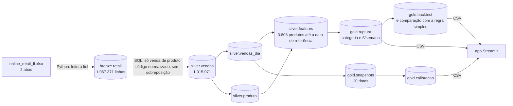

# Ruptura de Estoque

[](https://github.com/RodrigoRochaaa/ruptura-estoque/actions/workflows/ci.yml)


Quais produtos que vendiam com regularidade pararam de vender, há quanto tempo estão parados, e o que fazer com
cada um? Um pipeline SQL em camadas (bronze, silver, gold) sobre 1 milhão de linhas de um varejo britânico, com
o alerta **conferido com os 12 meses seguintes** e um app Streamlit para o time de supply chain.

> **36 produtos que vendiam com regularidade pararam de vender sem explicação comercial ou sazonal. Juntos,
> vendiam £2.519 por semana. Outros 159 provavelmente saíram de linha e pedem uma decisão de catálogo, não de
> reposição.**
>
> Diagnóstico em 09/12/2010.


## A ideia central: silêncio relativo

Dias sem vender não dizem muito sozinhos. Trinta dias parado é alarme para um produto que vendia quase todo dia,
e é rotina para um que vendia uma vez por mês. O projeto mede o silêncio **em múltiplos do ritmo do próprio
produto**:

```
silencio_relativo = dias desde a última venda / ritmo médio entre vendas (calculado só no período ativo)
```

<picture>
  <source media="(prefers-color-scheme: dark)" srcset="docs/img/silencio_relativo_escuro.png">
  
</picture>

## O alerta funciona? Conferido com o futuro

O arquivo original tem duas abas. O diagnóstico usa só os dados até 09/12/2010. A segunda aba, com os 12 meses
seguintes, fica guardada para responder se o alerta acertou.

<picture>
  <source media="(prefers-color-scheme: dark)" srcset="docs/img/calibracao_escuro.png">
  
</picture>

A taxa de retorno cai de faixa em faixa. O padrão se repete nas 19 datas de referência mensais testadas
(mar/2010 a set/2011), com uma exceção explicada abaixo (janeiro de 2011) e uma inversão de meio ponto entre as
duas primeiras faixas em maio de 2011. O rótulo único "Ruptura", porém, misturava situações
diferentes: dos 305 produtos que ele marcava, 76% nunca mais venderam. Isso é descontinuação, não falta de
estoque. Por isso o projeto separa os alertas por **causa provável**, e cada categoria pede uma ação diferente:

| Categoria | Produtos | £/semana no ritmo histórico | Voltou a vender em 90 dias | Em 1 ano | Ação |
|---|---:|---:|---:|---:|---|
| Ruptura provável | 36 | £2.519 | 33% | 39% | Checar estoque e fornecedor; repor |
| Monitorar | 101 | £5.888 | 59% | 67% | Acompanhar na próxima semana |
| Sazonal | 27 | £2.895 | 37% | 48% | Planejar a próxima temporada |
| Provável descontinuação | 159 | £13.553 | 8% | 10% | Confirmar com compras e limpar o catálogo |
| Cliente principal parou | 20 | £1.358 | 5% | 5% | Ação comercial, não de estoque |

**A métrica contra uma regra simples.** Com o mesmo número de alertas (305), "parado há 18 dias ou mais" acerta
78,7% (produto que parou de vez), e o silêncio relativo acerta 76,4%. A AUC é de 0,966 contra 0,959. O
silêncio relativo **não** prevê melhor quem vai parar. O ganho dele é outro: dispara com 13 dias de silêncio
(mediana), contra 18 da regra simples, ou seja, **avisa 5 dias antes**, justamente nos produtos que vendem com
frequência.

**Uma data só engana.** De março a novembro, a maioria dos produtos entre 3× e 10× o ritmo volta a vender em 90
dias, o perfil de uma falta temporária. Em dezembro, poucos voltam. Em janeiro de 2011, logo depois do recesso
de Natal (loja fechada), todos os produtos parecem parados e a relação se inverte. A aba *Confiabilidade* do
app mostra as 20 datas lado a lado.

## Arquitetura



- **Toda regra de negócio fica no SQL** (`sql/`), numerada na ordem de execução. O app só apresenta.
- **`python pipeline.py`** roda tudo do Excel ao app em cerca de 80 segundos. Os passos são: carga da bronze com
  `COPY`, os 11 arquivos SQL, **10 checks de qualidade** (`sql/checks/`, cada um deve retornar zero linhas) e a
  exportação dos CSVs em `data/app/`. Se um check falha, os arquivos do app não são atualizados.
- **Sem vazamento de futuro.** As features usam só `dia <= data_ref`, e há um check garantindo isso. O snapshot
  de 09/12/2010 é calculado por outro caminho e precisa bater com a features.
- **O app roda sem banco** e é o que vai para o Streamlit Community Cloud. O CI roda lint e testes contra os
  CSVs versionados.

## O que o projeto não faz

- **Não há posição de estoque, fornecedor nem prazo de reposição no dado.** O projeto identifica o sintoma e a
  causa provável, não a causa confirmada.
- **Voltar a vender não prova que houve ruptura.** É o indicador indireto que o dado permite.
- **Sazonalidade é aproximada pelo nome do produto.** A comparação ano contra ano é a próxima etapa.
- **O tempo é contado em dias corridos.** A loja quase não abre aos sábados e fecha no Natal, o que distorce
  datas logo depois de feriados (o caso de janeiro de 2011).
- **£/semana é uma projeção do ritmo histórico**, não uma perda observada.

## Como rodar

Só o app (usa os CSVs já versionados):

```bash
pip install -r requirements.txt
streamlit run app.py
```

O pipeline completo requer PostgreSQL e o Excel original (ver [`data/instrucoes_download.md`](data/instrucoes_download.md)):

```bash
pip install -r requirements-pipeline.txt
cp .env.example .env          # preencha DATABASE_URL
python pipeline.py            # Excel → bronze → silver → gold → checks → data/app
pytest                        # contrato dos arquivos do app e teste de fumaça
```

## Estrutura

```
├── app.py                    # Streamlit: só lê data/app
├── pipeline.py               # roda tudo: extração, SQL, checks, exportação
├── sql/
│   ├── 00_schemas.sql … 10_gold_exemplo.sql
│   ├── checks/               # 10 testes de qualidade de dado
│   └── export/               # cada SELECT vira um CSV do app
├── data/
│   ├── app/                  # o que o app lê (versionado)
│   └── instrucoes_download.md
├── notebooks/                # EDA e validação, formato # %%
├── scripts/figuras_readme.py # gera as figuras deste README
├── tests/
└── docs/                     # decisões e imagens
```

## O que aprendi

A primeira versão marcava como "ruptura" todo produto parado e estimava **£2,8 milhões** de faturamento perdido.
O número estava errado de duas formas. Primeiro, a conta multiplicava o faturamento *por dia de venda* por dias
*corridos*, o que inflava o valor 3,9 vezes. Segundo, quando conferi o alerta com os 12 meses seguintes, 76% dos
produtos marcados nunca mais venderam: eram produtos saindo de linha, não produtos sem estoque. A minha métrica
também empatava com a regra "dias sem vender" para prever quem ia parar.

O projeto mudou por causa disso. O impacto virou uma taxa (£/semana), e os alertas foram separados por causa
provável, cada um com a taxa de acerto que teve no backtest. O silêncio relativo passou a ser apresentado pelo
que ele faz bem: avisar mais cedo. Além disso, a caixa dos códigos de produto (`85099B` e `85099b` são o mesmo
item) e uma mediana digitada à mão, que tinha ficado velha, também geravam alertas falsos. Os dois problemas
viraram checks.

As decisões e os números de cada etapa estão em [`docs/decisoes.md`](docs/decisoes.md).

## Dados

Chen, D. (2012). *Online Retail II* [Dataset]. UCI Machine Learning Repository.
[https://doi.org/10.24432/C5CG6D](https://doi.org/10.24432/C5CG6D). Licença CC BY 4.0. Loja online britânica,
dezembro de 2009 a dezembro de 2011. Valores em libras (£).
